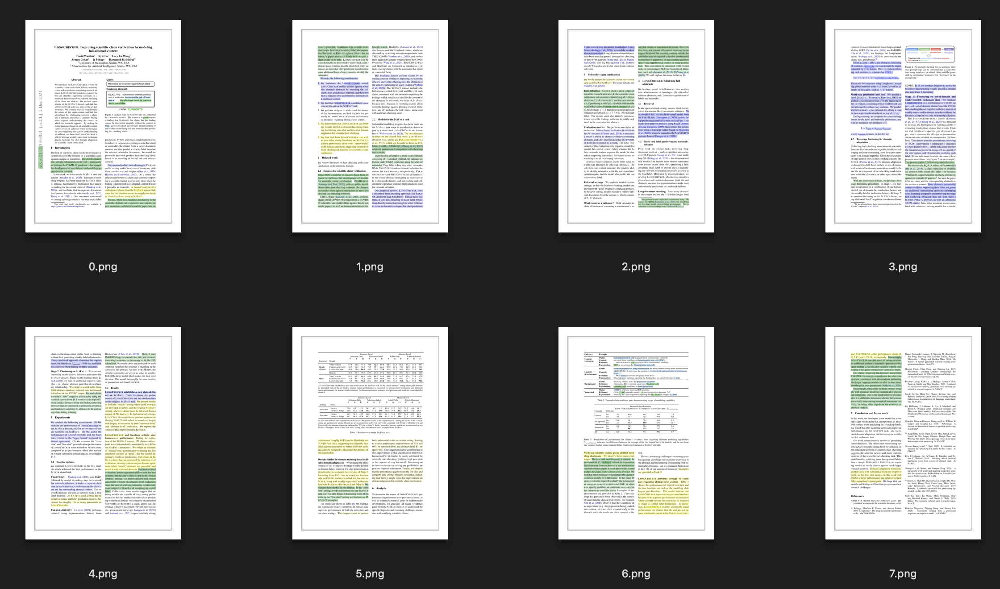

# Extract Significant Sentences

This code can be used to extract significant sentences from a pdf.

Also includes code for weak labeling of full-text scientific documents for significant statements and statement facet classification.

This research project was conducted in late 2022, and the code in this repository is no longer actively maintained.
Ideas from this initial development have been productionized within Semantic Scholar's [Semantic Reader](https://www.semanticscholar.org/product/semantic-reader) as skimming highlights. The paper processing pipeline, models, and user interface provided here should still be minimally functional, and can serve as a useful reference, albeit significantly deprecated.

## Installation

```bash
cd sse_skimming
pip install .
```

Notes:
- `pdf2image` requires Poppler; see [here](https://pdf2image.readthedocs.io/en/latest/installation.html) for installation

## Usage

```bash
python -m sse_skimming \
    src=path/to/file.pdf \
    dst=path/to/output/dir/for/visualization
```

For example, if ran with the [Longchecker pdf](https://arxiv.org/pdf/2112.01640v1), it should return the following output:


